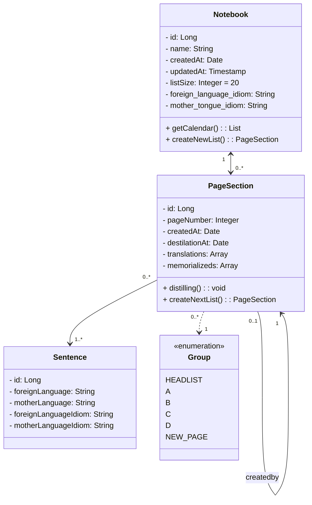

```mermaid
    classDiagram
        class Notebook {
            - id: Long
            - name: String
            - createdAt: Date
            - updatedAt: Timestamp
            - listSize: Integer = 20
            - foreign_language_idiom: String
            - mother_tongue_idiom: String

            + getCalendar(): List<Date>
            + createNewList(): PageSection
        }        

        class PageSection {
            - id: Long
            - pageNumber: Integer
            - createdAt: Date
            - destilationAt: Date
            - translations: Array<String>
            - memorializeds: Array<Boolean>
            + distilling(): void
            + createNextList(): PageSection
        }

        class Sentence {
            - id: Long
            - foreignLanguage: String
            - motherLanguage: String
            - foreignLanguageIdiom: String      
            - motherLanguageIdiom: String      
        }

        class Group {
            <<enumeration>>
            HEADLIST
            A
            B
            C
            D
            NEW_PAGE
        }
    
        Notebook "1" <--> "0..*" PageSection
        PageSection "0..1" --> "1" PageSection: createdby
        PageSection "0..*" --> "1..*" Sentence
        PageSection "0..*" ..> "1" Group
```
